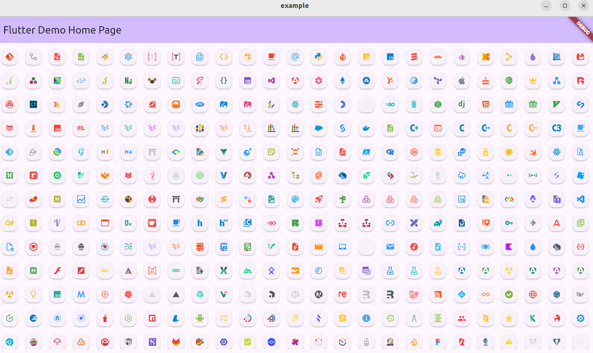

# vscode_material_icon_theme

A Flutter package that ports the popular [vscode-material-icon-theme](https://github.com/material-extensions/vscode-material-icon-theme) to Flutter. This package provides a comprehensive set of material-style icons for use in Flutter apps, inspired by the VS Code extension.

## Features

- Hundreds of material-style icons for files and folders.
- Easy integration with Flutter projects.
- Customizable icon mapping.



## Getting Started

```dart
import 'package:vscode_material_icon_theme/vscode_material_icon_theme.dart';

import 'package:flutter_svg/flutter_svg.dart';

final widget = SvgPicture(MaterialIcons.git);

final fileIcon = SvgPicture(fileToIcon('main.dart'));
final directoryIcon = SvgPicture(directoryToIcon('lib', isExpanded: true));
```

## Icon Naming Rule

If the icon name starts with a digit, it is prefixed with `num_` (e.g., `3d` becomes `num_3d`).

## Development

- Depends on [material-icon-theme](https://www.npmjs.com/package/material-icon-theme) for icon assets.
- SVGs are compiled to `.vec` format for efficient use in Flutter.

### Useful Commands

```bash
flutter pub get
cd generate-icon-variable
npm install
npm run dev
```

### publish

```bash
unset PUB_HOSTED_URL
dart pub publish --dry-run
dart pub publish
```

## TODO

- [ ] export vscode languageIds and pattern(write a plugin to do that)
